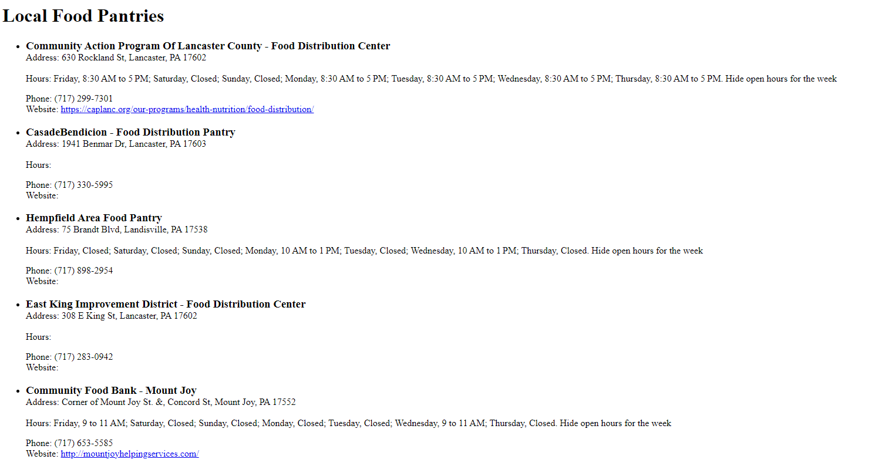
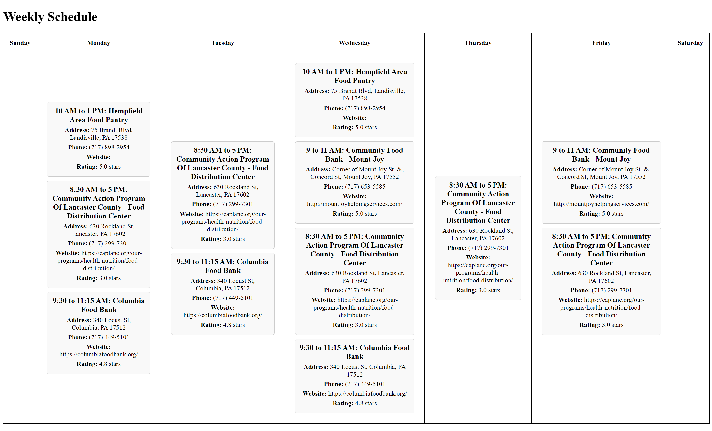

# Food Pantry Finder
*By Cooper Lindsley and Jessica Twitmyer*

## Mission
This tool quickly locates food pantries and organizes the information into a PDF. We want to make it easy for people to find the resources they need to feed themselves and their families.

Currently, if a person needs assistance in finding food services, they must do so over the phone with 2-1-1 or through an established connection with a social worker. These methods are reliable sources of care, but are time-consuming for the user, and hunger can't wait. We seek to expedite the search process with an easy-to-use tool that anyone with an internet connection can access.

Our program utilizes web-scraping to collect and organize data from google maps. We offer two visualizations of the data: a list and a weekly schedule. A user can choose to save the information as a PDF for future reference.

## Prototype Demonstration
### List

### Schedule

## Existing Features
- Asks the user for a location and then scrapes google maps for the first eight search results in that area (scrape.js -> pantries.csv)
- Organizes scraped data into a list (list.js -> list.html)
- Organizes scraped data into a weekly schedule (schedule.js -> schedule.html)

## Upcoming Features
- Web-hosting of our front-end and virtual machine with AWS.
  - The virtual machine will receive a data request from the front-end, carry out the web-scraping, and return the data.
- Allow user to input their location and distance to personalize search results.
- Allow user to edit the data for inaccuracies or missing details.

## Install Dependencies (requires node.js and pipenv)
  1. npm install
  2. pipenv install

## Run the Program
  1. npm run scrape

The files created by the program are located in:
- list.html
- schedule.html
